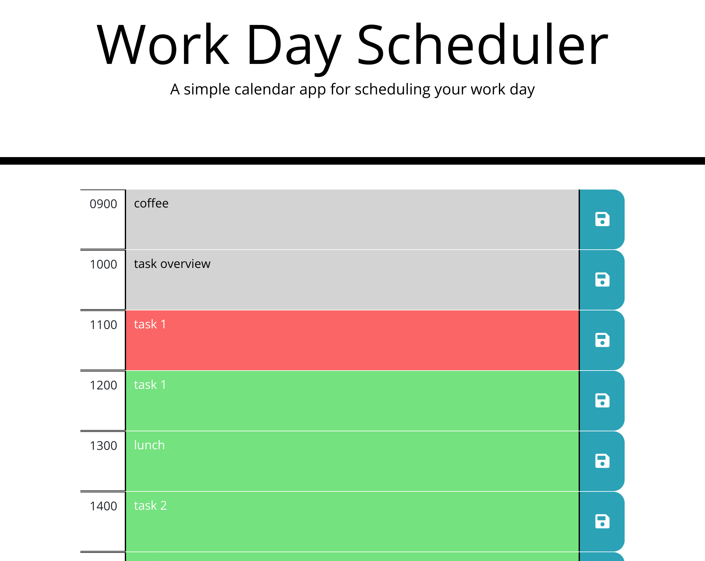

# Work Day Scheduler

# Description
A daily scheduler for the work day. The user can enter descriptions for hour blocks
and save them to local storage. Event descriptions persist on reload. Hour blocks
are colored depending on time of day.

[Deployed Link](https://technicalparadox.github.io/workdayscheduler)
